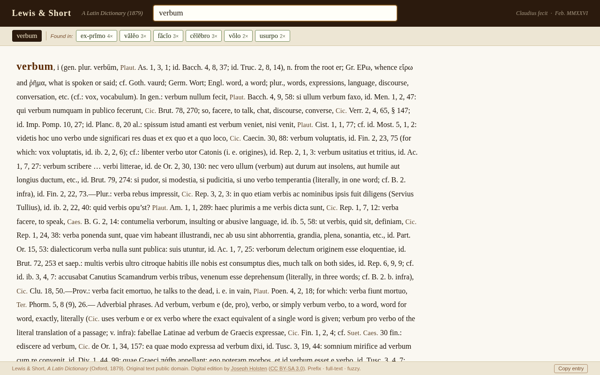

# Lewis & Short Latin Dictionary — Desktop Lookup App

A fast, locally-running browser application for searching
**Lewis & Short, *A Latin Dictionary* (Oxford, 1879)**.

The app runs entirely on your own computer — no internet connection required
after installation, no data sent anywhere, no accounts. You open it in any
web browser at `http://localhost:5050`.



---

## Features

- **Headword prefix search** — type the first letters of any headword and
  matching entries appear instantly as clickable buttons. Diacritical marks
  (macrons, breves) are ignored: type `abalieno` to find *ăb-ălĭēno*.

- **Full-text / inflected-form search** — if you type an inflected form that
  is not itself a headword (e.g. `texit`, `consulem`, `libertatem`), a
  "Found in:" row of buttons shows the dictionary entries whose text contains
  that form, ranked by how many times it occurs. Clicking a button loads the
  full entry. This is the most useful feature for reading continuous Latin text.

- **English→Latin reverse lookup** — because L&S definitions are in English,
  the full-text index doubles as a reverse dictionary. Type an English word
  (`exile`, `piety`, `senate`, `soldier`) and the "Found in:" row returns the
  Latin headwords whose entries discuss that concept, ranked by frequency of
  mention. Works best with specific nouns and verbs; very common English words
  produce longer, noisier lists.

- **Fuzzy fallback** — if neither of the above yields anything (uncertain
  spelling, mediaeval orthographic variant, etc.), the app suggests the
  closest-sounding headwords under a "Similar:" label.

- **Long entries are fully browsable** — entries such as *volo*, *cum*, or
  *contra* run to tens of thousands of characters; the browser's own Ctrl-F
  (Cmd-F on Mac) searches within them.

- **Copy entry** button copies the plain text of any displayed entry to the
  clipboard.

---

## Requirements

| Requirement | Version |
|---|---|
| Python | 3.9 or later |
| Flask  | 3.x (installed automatically — see below) |

Python is pre-installed on macOS. To check your version open Terminal and run:

```
python3 --version
```

If you need to install or upgrade Python, the simplest route on macOS is
[Homebrew](https://brew.sh): `brew install python`.

---

## Installation

1. **Download** this repository as a ZIP (click the green *Code* button →
   *Download ZIP*) and unzip it, or clone it:

   ```
   git clone https://github.com/pwgallagher/lewis-short-lookup.git
   ```

2. **Install Flask** (the only dependency). In Terminal, `cd` into the folder
   you just unzipped/cloned, then run:

   ```
   pip3 install flask
   ```

   That is the only package required.

---

## Running the app

From Terminal, inside the `lewis-short-lookup` folder:

```
python3 lewis_short_app.py
```

Or, on macOS, double-click `run_dictionary.sh` (you may need to mark it
executable first: `chmod +x run_dictionary.sh`).

Then open your browser and go to:

```
http://localhost:5050
```

Press **Ctrl-C** in the Terminal window to stop the app when you are finished.

### First run

The first time the app starts it builds a word index from the dictionary text.
This takes approximately 4–5 seconds and you will see the message:

```
Building word index (first run — this takes ~4 s) …
```

The index is saved as `lewis-short-wordindex.pkl` alongside the other files.
On all subsequent runs the app loads the cached index in under a second.
(If you ever delete the `.pkl` file, it will simply be rebuilt next time.)

---

## Files in this repository

| File | Description |
|---|---|
| `lewis_short_app.py` | The application (Python / Flask) |
| `run_dictionary.sh` | Convenience launch script (macOS / Linux) |
| `lewis-short-smart-quotes.txt` | The dictionary text (see attribution below) |
| `requirements.txt` | Python dependencies (`flask`) |
| `README.md` | This file |

The file `lewis-short-wordindex.pkl` is generated automatically on first run
and is **not** included in the repository.

---

## Licence and attribution

**Dictionary text** (`lewis-short-smart-quotes.txt`)

> *A Latin Dictionary* by Charlton T. Lewis and Charles Short (Oxford, 1879)
> is in the public domain. The machine-readable text file used here was
> prepared by **Joseph Holsten** and is released under the
> [Creative Commons Attribution–ShareAlike 3.0](https://creativecommons.org/licenses/by-sa/3.0/)
> licence. Source: [github.com/josephholsten/lewis-short](https://github.com/josephholsten/lewis-short)
> · [josephholsten.com](https://josephholsten.com)

Any redistribution of this repository must respect the CC BY-SA 3.0 terms:
attribution must be preserved and derivative works must carry the same licence.

**Application code** (`lewis_short_app.py`, `run_dictionary.sh`)

> Written by Peter Gallagher ([petergallagher.net](https://petergallagher.net)),
> with assistance from Claude (Anthropic), February 2026.
> Released under the [MIT Licence](https://opensource.org/licenses/MIT) —
> you are free to use, modify, and redistribute the code with attribution.

---

## Acknowledgements

- Charlton T. Lewis & Charles Short for a work that has served classical
  scholars for nearly 150 years.
- Joseph Holsten for the painstaking digitisation of the text.
- The [Flask](https://flask.palletsprojects.com) project.
